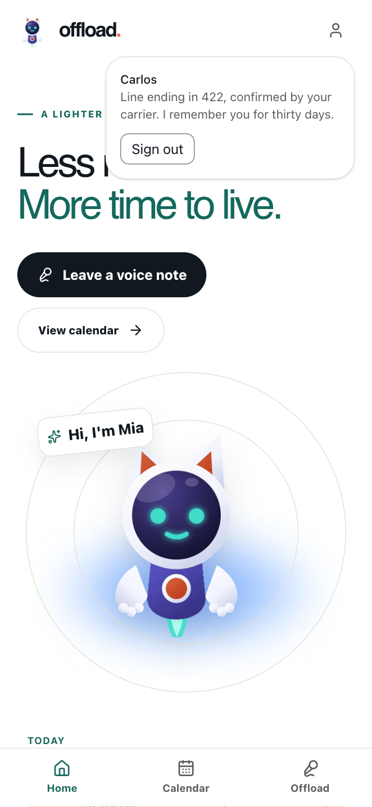
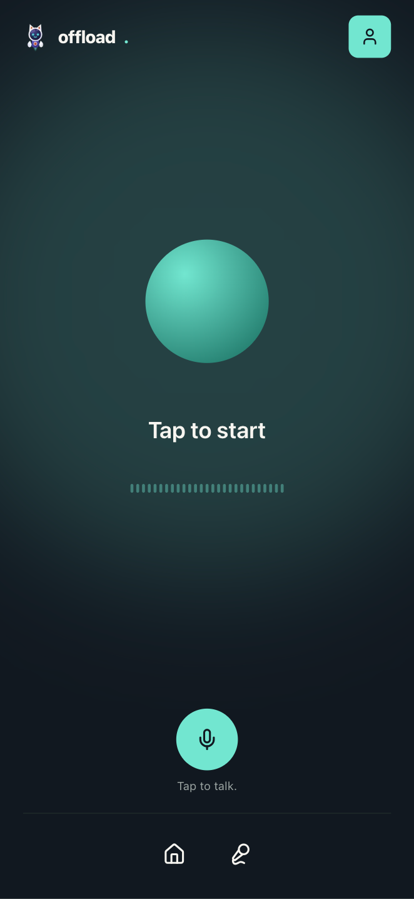
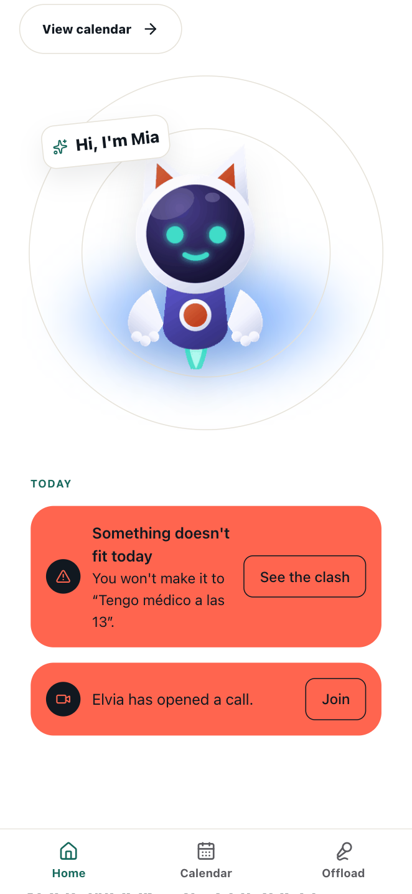
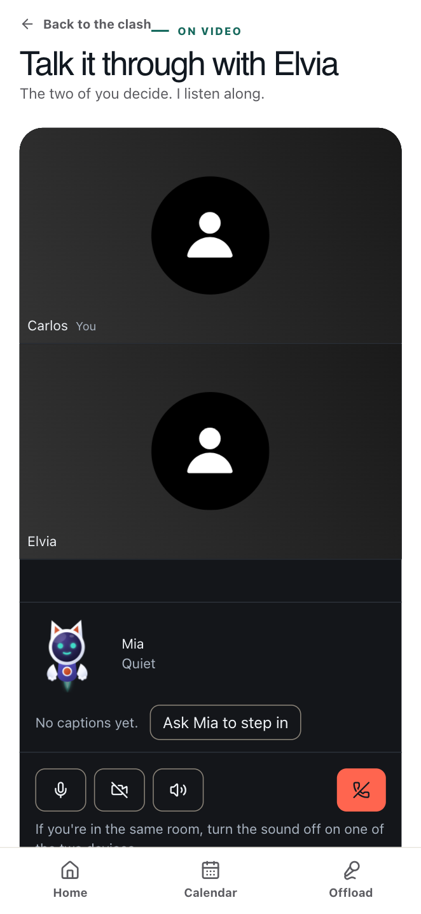

# OFFLOAD

A family app that shares out the mental load. Mia, the agent, finds the problems before anyone sees them, resolves on her own whatever changes nobody's plans, and only asks for a yes or a no when it matters. What it gives back, measured, is time.

[](https://github.com/ctrl-Ella/OffLoad/actions/workflows/ci.yml)
[](https://github.com/ctrl-Ella/OffLoad/issues)
[](https://github.com/ctrl-Ella/OffLoad/pulls)
[](https://github.com/ctrl-Ella/OffLoad/commits/main)

Built by team CTRL4ELLA for HackBarna AI Summit 26.

> **Status:** under construction. The skeleton is standing and continuous integration is green. The product is being built on top of it.

One run through the product, left to right: arrive to the day's screen, leave Mia a voice note, come back to find she's already sorted it — or, when she can't, surfaced the one clash that needs the two of you.

<table>
  <tr>
    <td align="center" width="25%">
      <br />
      <sub><b>1. The day, on arrival.</b><br />Mia and today's plan, already there.</sub>
    </td>
    <td align="center" width="25%">
      <br />
      <sub><b>2. Say it, don't type it.</b><br />A tap, then whatever's on your mind.</sub>
    </td>
    <td align="center" width="25%">
      <br />
      <sub><b>3. What Mia found.</b><br />A clash she can't resolve alone, and a call already open about it.</sub>
    </td>
    <td align="center" width="25%">
      <br />
      <sub><b>4. The two of you decide.</b><br />Mia listens along and only speaks once you're both stuck.</sub>
    </td>
  </tr>
</table>

---

## The problem

The mental load of running a home isn't the tasks: it's remembering they exist. Who takes the kid to the pool on Thursday if there's a meeting that afternoon, whether someone is passing near the supermarket on the way somewhere else, who can be asked for help without it costing something.

That doesn't get shared with a shared list, because the list itself still has to be carried by someone.

## How it works

Mia watches the core family's calendars and finds the clashes before they happen. Then she asks herself one question:

> **Does this change anyone's plans?**

| Answer | What Mia does |
|---|---|
| It doesn't | She resolves it herself and says so. Attaching an errand to a trip someone was making anyway, reordering reminders, building the shopping list |
| It does | She prepares the whole thing and asks for a yes or a no. One card, two buttons |
| A yes or a no won't settle it | Video call. It's the exception, and how rarely it happens is the measure of success |

The interface is mobile first, the main input is voice, and Mia speaks Spanish from Spain.

### Two circles, and the difference is structural

The **core** connects their Google accounts, and Mia sees their calendars. The **support network** — a grandparent, a neighbour, a friend — only exists in the contact list: Mia sees nothing of theirs, cannot know whether they're free, and **never claims they're available**. Finding out means calling them, and that's why the video call exists.

## The technical thesis

> **The model interprets, the workflow decides.**

Working out that two stops collide is arithmetic over times and distances, and you don't ask a language model for that. The model gets only what a deterministic machine can't do: understanding a sentence said out loud, and choosing who's the right person to ask.

Of the eight steps in a run, only two touch a model — and the one that decides the most touches none.

State lives in Postgres, so the process suspends waiting for someone to answer and resumes at the exact step, even across a server restart. A conflict is a state of the system, not an error.

## Who does what

| Piece | Responsibility |
|---|---|
| **Mastra** | Orchestration, state and typed tools |
| **Nebius Token Factory** | All the reasoning, at two model tiers |
| **Vonage** | The video session, live captions and the phone bridge |
| **SLNG** | Everything Mia says and hears outside the call |
| **Google** | Calendar and Tasks for the core |
| **Make** | The side effects of a decision already taken |

Built on Next.js 16, React 19, Prisma 7 and Tailwind 4, in TypeScript throughout.

## Sponsors

What each hackathon sponsor's platform actually does in this project, not what it could do.

**Vonage** — three real capabilities, all shipped. The video call itself: a `routed` session, not peer-to-peer, because that's what Live Captions needs to run — it's literally how Mia hears what's said during a call. Silent Auth: phone sign-in with no code to type, confirmed over the carrier's own network. And SMS: on command, during a call, Mia texts someone from the support network a signed, time-limited link that lets them join with no sign-in at all. Checking the SMS API against Vonage's own documentation turned up something the rest of this project doesn't do: it authenticates with a plain API key and secret, not the JWT everything else here uses — a deliberate, documented exception, not an oversight.

**Nebius (Token Factory)** — two model tiers, both constrained to structured JSON-schema output, so a response that breaks the schema is impossible rather than merely unlikely. A small model extracts events and tasks out of a dictated sentence or a call's transcript; a larger one, the negotiator, decides who to ask and writes the proposal. Which model fills each tier came from measuring real candidates against a benchmark, not from picking a name off the catalogue: the intent classifier reaches 93.3% accuracy over 30 written cases (`bench/results/`). That figure is over typed sentences, not spoken ones — the thirty voice recordings needed to measure the same classifier against what a person actually says out loud are made, but the comparison run itself hasn't happened yet. [`docs/specs/0004-nebius-benchmark-and-voice-measurement.md`](docs/specs/0004-nebius-benchmark-and-voice-measurement.md) is the plan for it, staged and not yet done.

**SLNG** — both directions of Mia's voice outside the video call. Speech-to-text turns a recorded voice note into a transcript; text-to-speech is Mia's own voice, both the short clips she plays and the streaming voice used live inside a call. Worth saying plainly: the first speech-to-text model tried — the one SLNG's own examples point to — turned out to silently ignore Spanish and transcribe only English. The path that actually works is SLNG's batch API with Speechmatics instead.

**Norma (QualityClouds)** — static analysis run against the real code partway through the build. It flagged genuine gaps: two API routes that only handled a failure on their first network call and not the steps after it, and every network request in the project missing a timeout. Both are fixed. Not every finding was acted on as reported: a couple turned out to be false positives on inspection — a synchronous call flagged as an async one, an error already handled one call frame up — and were left alone rather than "fixed" to match the report. The full account of what was fixed, what wasn't, and why, is in [`DEFENCE.md`](DEFENCE.md).

## The six rules that never break

Covered by tests, and they block the merge:

1. Nothing is ever written to a calendar without human confirmation
2. Mia doesn't play audio until someone has given her the floor
3. Nobody in the support network is ever described as available
4. Mia announces nothing that isn't true yet
5. Proximity is measured between stops, never between people
6. Time-saved figures are either computed or declared as estimates

## How to run it

Needs Node 22.13 or later and a Postgres database.

```bash
npm ci
cp .env.example .env        # and fill in the values
npx prisma generate
npm run dev
```

Which credentials to set up, in what order, and their traps, are in `docs/guides/`. `.env` never gets committed: what's versioned is `.env.example`, with the variable names and not a single value.

## How we work

`main` is production and `dev` is where work integrates. Every branch comes off `dev` with its issue number in the name, and returns by pull request. No task starts with the code: first it's written down what will be done and how it'll be known to be done.

| Where | What's there |
|---|---|
| [`docs/workflow/`](docs/workflow/) | Branches and pull requests, commits, issues and labels, spec-driven development |
| [`docs/specs/`](docs/specs/) | One spec per task, plus the template |
| [`docs/decisions/`](docs/decisions/) | Architecture decisions, with their rejected alternatives |
| [`docs/guides/`](docs/guides/) | Accessibility and automations |
| [`CLAUDE.md`](CLAUDE.md) | The context Claude Code sessions work from |
| [`CHANGELOG.md`](CHANGELOG.md) | What's changed, one line per pull request |

## Accessibility

The bar is **EN 301 549, which points to WCAG 2.1 level AA**, a scope decision reasoned through in [`docs/guides/accessibility.md`](docs/guides/accessibility.md).

What doesn't depend on that level is met all the same: focus always visible, full keyboard support, real labels, `prefers-reduced-motion`, mobile landscape and 200% zoom. Every colour token carries its measured contrast, because a token is a promise, and one left unmeasured breaks silently.
